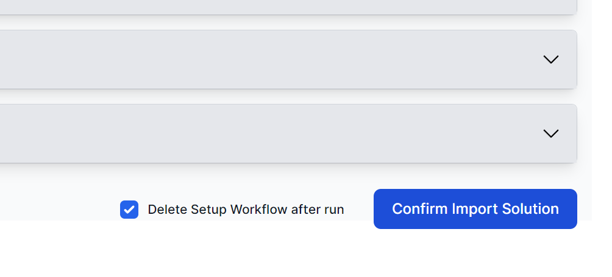

# CRM

Welcome to the CRM Solution for World of Workflows. This Solution introduces a simple CRM with Leads, Customers, Opportunities and contacts.

It includes the following features:

1. Online CTA (Call to Action Form)
2. Follow Up Action to Force Opportunity Follow-Up
3. Lead Qualification Workflow

## Getting Started

## Getting Started

1. Import the Solution
2. Go to **Admin -> Solutions**
3. Click **Import Solution** 
4. Browse and find the [CRM Zip file](./Solution/CRM.zip):
   1. 
5. Click **Confirm Import Solution**
   1. 