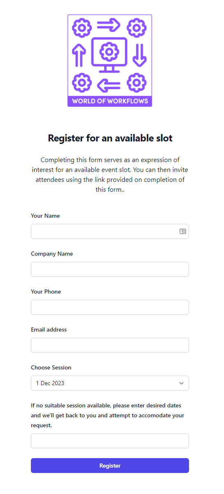
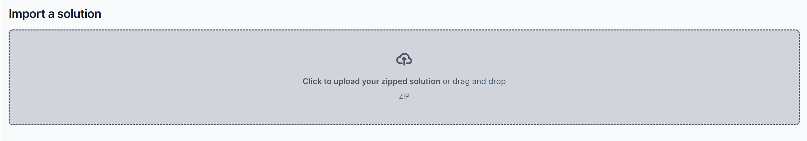
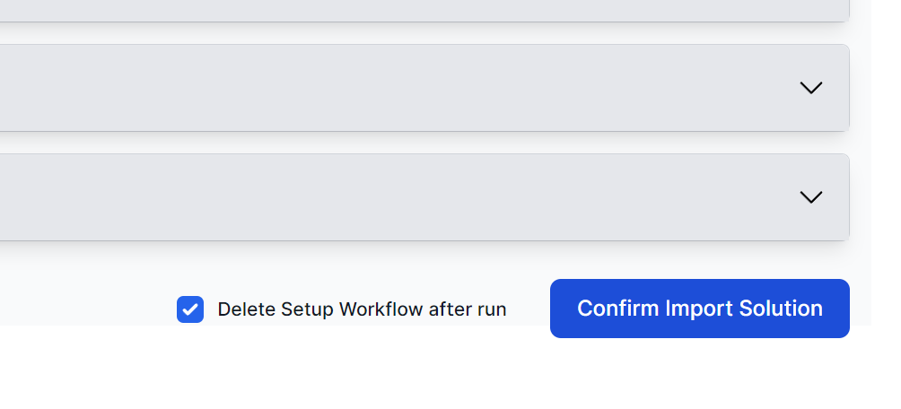

# Registration System

The Registration system has the following features:

1. Allows the Administrator to make available any event slots they wish
2. Allows Customer Organizers to register for one of those slots and receive an invitation link
3. Allows participants to register using the registration link
4. Has Views of:
   1. Events
   2. Registered Events
   3. Attendees for Events

## Access using PE

https://localhost:7068/register

## Getting Started

1. Import the Solution
2. Go to **Admin -> Solutions**
3. Click **Import Solution** 
4. Browse and find the Registration System Solution Zip file:
   1. 
5. Click **Confirm Import Solution**
   1. 

## Tips and Tricks

- **Liquid** - See how liquid is used to amend the lists and dropdowns in the form
- **Work with the UI** - Use Visual Studio Code as the Live Server Extension
- 